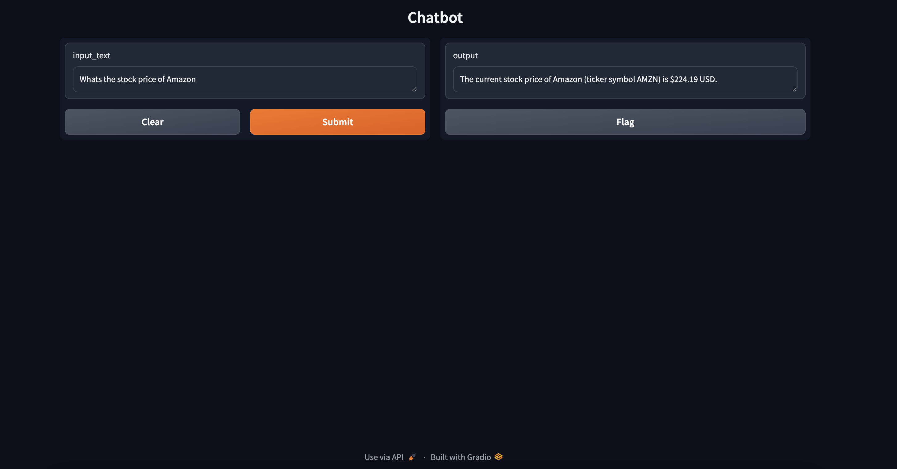

# Function calling using Amazon Bedrock with Anthropic Claude 3

Amazon Bedrock is a fully managed service that offers a choice of high-performing foundation models from leading AI companies and a set of capabilities to build generative AI applications.

This sample repo provide an example for using function calling using the [Converse API](https://boto3.amazonaws.com/v1/documentation/api/latest/reference/services/bedrock-runtime/client/converse.html) with [Anthropic Claude 3 Sonnet](https://aws.amazon.com/about-aws/whats-new/2024/03/anthropics-claude-3-sonnet-model-amazon-bedrock/), using multiple tools. This repo is a sample only code, that demonstrate how to use function calling as tools for a model to use to fetch results using plain function code.

The `Converse` API provides a consistent interface that works with all models that support messages. This allows you to write code once and use it with different models. Should a model have unique inference parameters, you can also pass those unique parameters to the model.

## Overview

Function calling (also known as tools), is a way to provide the model, with a descriptive guidance for a function that is available to the model to use for answering the user input. 

In this sample, we will ask a Claude 3 to answer, what is a stock ticker value, and with option to convert the default ticker currency to any currency that was provided in the user input.

## Tools

There are 2 tools available to the models to use:

* get_stock_price - given a ticker string, the open source library [yfinance](https://pypi.org/project/yfinance/) will get the current stock value, and currency that its being traded.
* convert_currency - given an amount, source and target currency, the open source library [CurrencyConverter](https://pypi.org/project/CurrencyConverter/) will convert the amount given from source currency to target currency.

The model each turn will review the prompt given, will decide if it can answer properly the question provided in the user input, each turn according to the response from Bedrock `end_turn` or `tool_use`. `end_turn` means that the final answer was provided, and `tool_use` will parse the appropriate data per the tool description that will be used to execute the tool function, and build a proper result back to the model.

>This sample code was tested using [pyenv](https://github.com/pyenv/pyenv) with python 3.12, and set in [.python-version](.python-version)

## Setup

1. **AWS Configuration**:
    - Ensure you have an AWS account and the AWS CLI installed and configured.
    - AWS region for this sample uses `us-west-2`, and be configured in [ask.py](pkg/ask.py)

2. **Bedrock Access**:
    - If its the first time using Bedrock, please review [Manage access to Amazon Bedrock foundation models](https://docs.aws.amazon.com/bedrock/latest/userguide/model-access.html) 
    - To add model access, ensure that the user logged in has the minimum permissions for adding an AWS marketplace subscription:
        - aws-marketplace:Subscribe
        - aws-marketplace:Unsubscribe
        - aws-marketplace:ViewSubscriptions
    - In AWS Console under Amazon Bedrock service, go to [model access](https://us-west-2.console.aws.amazon.com/bedrock/home?region=us-west-2#/modelaccess), click on **Modify model access** and enable **Claude 3 Sonnet**, the model id is shown in [ask.py](ask.py) `anthropic.claude-3-sonnet-20240229-v1:0`

3. **IAM permissions**:
    - Make sure that the IAM user that runs this project, make sure that he as the permissions to invoke Claude 3 models.
    For this sample, you can use:

        ```json
        {
        "Version": "2012-10-17",
        "Statement": [
            {
            "Sid": "LeastPrivilege4BRClient",
            "Effect": "Allow",
            "Action": [
                "bedrock:InvokeModel"
            ],
            "Resource": "arn:aws:bedrock:us-west-2::foundation-model/*"
            }]
        }
        ```

>This can be more restricted using least privileges with the specific model id.

## Usage

To run this sample code follow these steps:

1. **Install dependency** - run `pip install -r requirements.txt` 
2. **Run the script** - run the `python main.py`
3. **Command line argument** - Optionally you can add `--input "new input here"` to overide the default user input text.

### Chatbot UI 
To run the chatbot interface, follow these steps:

1. Start the chatbot interface by running the following command:
   ```bash
   python chatbot_interface.py
   ```
   You should see output similar to:
   ```
   Running on local URL:  http://127.0.0.1:7860
   
   To create a public link, set `share=True` in `launch()`.
    ```
2. Open the provided local URL in your web browser to start chatting.

3. The UI will look like the following: 

### Example

**Default prompt**: "What is the current stock price of amazon stock in pounds?

For example Anthropic Claude 3 Sonnet will know the Amazon Ticker is AMZN, will use the tool get the ticker value, and then will convert the source currency of the stock price to the destination currency.

Each iteration of inference, when a `tool_use` is returned, the returned messages will be appended to build a conversation like for the model, due to the nature of LLM's being stateless.

The final prompt, before the final answer from the Claude 3 will look similar to this:

```json
[
    {
        "role": "user",
        "content": [
            {
                "text": "What is the current stock price of amazon stock in pounds?"
            }
        ]
    },
    {
        "role": "assistant",
        "content": [
            {
                "text": "Okay, let me get the current Amazon (AMZN) stock price and convert it to British pounds for you:"
            },
            {
                "toolUse": {
                    "toolUseId": "tooluse_7ofuIPr8T3uBsK2xy1GZBw",
                    "name": "get_stock_price",
                    "input": {
                        "ticker": "AMZN"
                    }
                }
            }
        ]
    },
    {
        "role": "user",
        "content": [
            {
                "toolResult": {
                    "toolUseId": "tooluse_7ofuIPr8T3uBsK2xy1GZBw",
                    "content": [
                        {
                            "json": {
                                "ticker": "AMZN",
                                "price": 200,
                                "currency": "USD"
                            }
                        }
                    ]
                }
            }
        ]
    },
    {
        "role": "assistant",
        "content": [
            {
                "text": "The current Amazon stock price is $200.00 USD. To convert that to British pounds:"
            },
            {
                "toolUse": {
                    "toolUseId": "tooluse_lyTta3oMSfik5EhsCnnkGg",
                    "name": "convert_currency",
                    "input": {
                        "amount": 200,
                        "source_currency": "USD",
                        "target_currency": "GBP"
                    }
                }
            }
        ]
    },
    {
        "role": "user",
        "content": [
            {
                "toolResult": {
                    "toolUseId": "tooluse_lyTta3oMSfik5EhsCnnkGg",
                    "content": [
                        {
                            "json": {
                                "converted_currency": 158.0185237159697
                            }
                        }
                    ]
                }
            }
        ]
    }
]
```

And the final answer should be similar to this: `So the current Amazon (AMZN) stock price of $200.00 USD converts to £158.02 GBP.`

>**Note:** Stock prices and currency exchange rates are highly volatile and can change rapidly. The example output shown in this README may not reflect current market values. When running the code, you'll get real-time data which may differ from the examples provided.

## Security

See [CONTRIBUTING](CONTRIBUTING.md#security-issue-notifications) for more information.

## Contributing

See [CONTRIBUTING](CONTRIBUTING.md) for more information.


## License

This project is licensed under the Apache-2.0 License.

